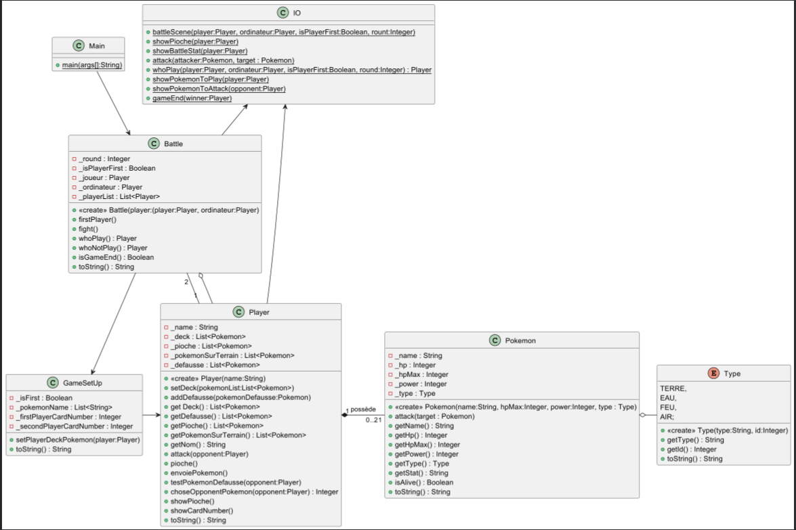
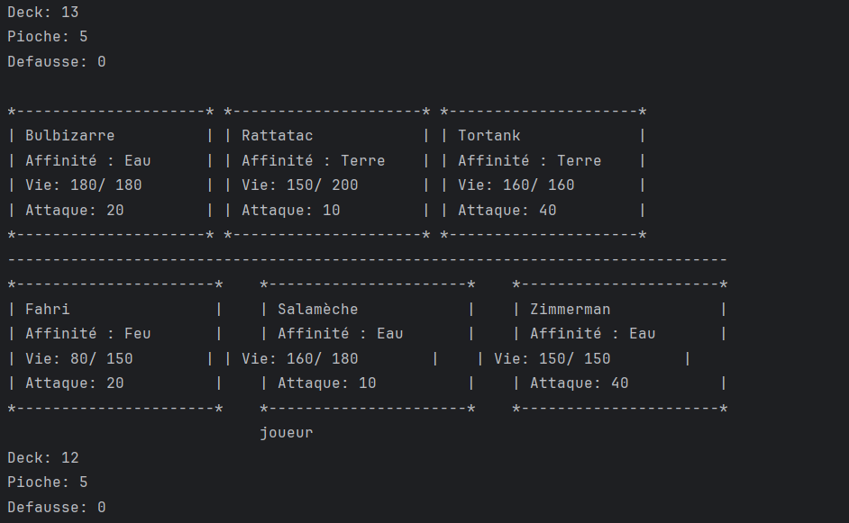

# Projet POOkemon
 
## Semaine 1

Tout d'abord, on a décidé de créer un fichier `Main.java` pour mettre la méthode *main* dans cet classe et non dans le 
fichier `Pokemon.java` afin de nous faciliter. On a notamment créé `Player.java` et `GameSetUp`, pour ça, on va vous 
expliquer ci-dessous.

### Classe 'GameSetUp'

La classe *GameSetUp* permet d'initialiser le jeu en configurant les decks des joueurs et permet aussi de gérer la
distribution aléatoire des Pokémons pour chaque joueur. Avec la méthode *setPlayerDeckPokemon*, elle permet de définir
le deck à 20 Pokémons si le joueur commence sinon le deck à 21 Pokémons.  

```java
public void setPlayerDeckPokemon(Player player){
  List<Pokemon> pokemonList = new ArrayList<>();

  for(int i=0;i<(this._isFirst?_firstPlayerCardNumber:_secondPlayerCardNumber);i++){//Pour vérifier si le joueur est le premier à jour pour lui distribuer le bon nombre de cartes
    int randomPokemonName = new Random().nextInt(this._pokemonName.toArray().length);
    String name = this._pokemonName.get(randomPokemonName); //Nom random
    this._pokemonName.remove(randomPokemonName);//Retire le nom utilisé de la liste pour pas que deux Pokémons aient le même nom
    int hp = (new Random().nextInt(21-10) + 10)*10; //Vie random qui est un multiple de 10 compris entre 100 et 200
    int power = (new Random().nextInt(5-1) + 1)*10; //Force d'attaque random qui est un multiple de 10 compris entre 10 et 40
    Type randomType = Type.values()[new Random().nextInt(Type.values().length)];  //Affinité random
    pokemonList.add(new Pokemon(name,hp,power,randomType));
  }

  player.setDeck(pokemonList);
  this._isFirst = false;//Pour enlever le premier qui joue, dès que le premier a été distribué son deck, le isFirst devient false pour tout le temps
}
```

On a aussi décidé de mettre le stockage des noms de Pokémon dans une liste, mais on va l'optimiser plus tard dans un 
document *.txt*.

```java
    private List<String> _pokemonName = new ArrayList<> (Arrays.asList(
            "Bulbizarre", "Herbizarre","Florizzare",
            "Salamèche", "Reptincel", "Draceaufeu",
            "Carapuce", "Carabaffe", "Tortank",
            "Pikachu", "Raichu",
            "Roucool", "Roucoups", "Roucarnage",
            "Rattata", "Rattatac",
            "Piafabec", "Rapasdepic",
            "Sabelette", "Sablaireau",
            "Mélofée", "Mélodelfe",
            "Goupix", "Feunard",
            "Taupiqueur", "Triopikeur",
            "Miaouss", "Persian",
            "Psykokwak", "Akwakwak",
            "Krabby", "Kraboss",
            "Osselait", "Ossatueur",
            "Hypotrempe", "Hypocéan",
            "Yang","Fahri",
            "Zimmerman", "Krähenbühl", "Le-Quentrec"
    ));
```

### Classe 'Player'

Nous avons complété la classe *Player* en ajoutant des méthodes pour manipuler les *decks*, la *pioche* et la *défausse* 
des joueurs. Ces méthodes permettent notamment de :

- *attack()* : attaquer l'adversaire avec les Pokémon non encore joués

```java
public void attack(Player opponent,List<Pokemon> pokemonNotPlayed){
  Scanner scanner = new Scanner(System.in);
  while (!pokemonNotPlayed.isEmpty()) {
    IO.showPokemonToPlay(pokemonNotPlayed);

    try {
      int chosePokemon = scanner.nextInt() - 1;
      pokemonNotPlayed.get(chosePokemon).attack(opponent._pokemonSurTerrain.get(choseOpponentPokemon(opponent)));
      pokemonNotPlayed.remove(chosePokemon);
    } catch (Exception e) {
      System.out.println("❗ LE POKEMON EST INTROUVABLE veuillez rechoisir");
      scanner.nextLine();// Vider la ligne pour éviter une boucle infinie en cas d'entrée invalide
    }

  }
}
```

- *pioche()* : tant que la liste des pokemons piochés soit inférieur ou égal à 4 et que la liste de tous les pokemons est 
pleine alors piocher les pokemons, ajouter dans _pioche et retirer dans _deck, les pokemons piochés.

```java
public void pioche(){
  while (this._pioche.size()<5 && !this._deck.isEmpty()){
    int randomPokemon = new Random().nextInt(this._deck.size());
    this._pioche.add(this._deck.get(randomPokemon));
    this._deck.remove(randomPokemon);
  }
}
```

- *envoiePokemon()* : envoyer un Pokemon sur le terrain

```java
public void envoiePokemon() {
  while(this._pokemonSurTerrain.size() < 3 && !this._pioche.isEmpty()){
    int randomPokemon = new Random().nextInt(this._pioche.size());
    this._pokemonSurTerrain.add(this._pioche.get(randomPokemon));
    this._pioche.remove(randomPokemon);
  }
}
```

- *testPokemonDefausse()* : vérifier si des Pokémon doivent être défaussés et les défausser si nécessaire

```java
public void testPokemonDefausse(Player opponent){
  for(Pokemon pokemon : new ArrayList<>(this.getPokemonSurTerrain())){
    if (!pokemon.isAlive()){
      opponent.addDefausse(pokemon);
      this._pokemonSurTerrain.remove(pokemon);
    }
  }
}
```

- *choseOpponentPokemon()* : choisir le Pokémon de l'adversaire à attaquer

```java
public int choseOpponentPokemon(Player opponent){
  IO.showPokemonToAttack(opponent);
  return new Scanner(System.in).nextInt()-1;
}
```

- ainsi d'autres méthodes qui permet de retourner les listes, de faire des appels à des méthodes de la classe *Battle*

## Classe 'IO'

Pour l'affichage du jeu, au lieu de faire sur le main, on a décidé de créer un fichier `IO.java` donc le nom complet est 
Input/Output. Ceci permettra de faciliter la classe *Main* en faisant appel à la classe *Battle* qui lui fait appel à la 
classe *IO*.

Donc cet classe IO a été mise pour gérer l'affichage des différentes étapes du jeu. Nous avons ajouté des méthodes pour 
afficher la scène de bataille, les Pokémons en main, les statistiques de combat, etc.

## Classe 'Battle'

Afin de gérer le déroulement de combat et de la scène de combat, on aura besoin de la classe *Battle*.
La classe Battle a été introduite pour gérer le déroulement des combats entre les joueurs. Elle comprend des méthodes 
pour déterminer le premier joueur, exécuter les tours de jeu, et vérifier si la partie est terminée. Pour ça, on aurait
besoin de ces méthodes pour :

- firstPlayer() : déterminer aléatoirement qui commence en premier en appelant la classe *GameSetUp* pour initialiser les 
decks des joueurs en fonction du premier joueur.

```java 
public void firstPlayer(){
  GameSetUp gameSetUp = new GameSetUp();

  if(new Random().nextInt(2)== 0){
    // 0 : Joueur Premier
    System.out.println("Vous êtes le premier à jouer !");
    gameSetUp.setPlayerDeckPokemon(this._joueur);
    gameSetUp.setPlayerDeckPokemon(this._ordinateur);
    this._isPlayerFirst = true;
  }
  else {
    // 1 : Ordinateur Premier
    System.out.println("L'ordinateur est le premier à jouer !");
    gameSetUp.setPlayerDeckPokemon(this._ordinateur);
    gameSetUp.setPlayerDeckPokemon(this._joueur);
  }

}
```

- fight() : démarrer le combat

- whoPlay() : déterminer le joueur qui doit jouer

```java 
public Player whoPlay(){
  if(this._isPlayerFirst)
    return this._round % 2 == 1 ? this._joueur : this._ordinateur;
  else
    return this._round % 2 == 1 ? this._ordinateur : this._joueur;
}
```

- whoNotPlay() : déterminer le joueur qui ne doit pas jouer

```java 
public Player whoNotPlay(){
  if(!this._isPlayerFirst)
    return this._round % 2 == 1 ? this._joueur : this._ordinateur;
  else
    return this._round % 2 == 1 ? this._ordinateur : this._joueur;
}
```

- isGameEnd() : vérifier si la partie est terminée

```java
public Boolean isGameEnd(){
        for (Player player : this._playerList){
            if(player.getPokemonSurTerrain().isEmpty() && player.getDeck().isEmpty() && player.getPioche().isEmpty()){
                return true;
            }
        }
        return false;
    }
```

### Enumération Type

Afin de faciliter le code pour les Pokemons, on a décidé de les types avec un nom du type et un ID pour le type pour 
faciliter le calcul des avantages d'affineté.

### Diagramme de classe complet

Donc si on veut les représenter sous forme de diagramme de classe complet, elle ressemblerai à ça :



### Refactoring du code

Nous avons fait également procédé à un refactoring du code pour améliorer sa lisibilité et sa maintenabilité. Cela inclut
les commentaires à chaque méthode, la réorganisation des méthodes, la correction des noms de variables, et l'optimisation
des boucles.

### Prochaines étapes

- Mettre en place le jeu de joueur contre l'ordinateur car à savoir que le jeu se joue non contre l'ordinateur mais 
contre un autre joueur donc ça se joue à deux.
- Changement du List<String> _pokemonName en un document *.txt* ou d'une autre manière de stocker les noms
- Améliorer l'affichage car par exemple on a tendance à avoir que la bordure à chaque Pokémon sur terrain dépasse 
à cause de la taille mais c'est rare d'avoir cet erreur (image ci-dessous)
- Mettre un accueil qui affiche le logo et le choix de jouer soit contre un ordinateur ou soit contre un autre joueur



### Temps passés

- Mercredi 24/04 : 4h
- Vendredi 26/04 : 7h
- Samedi 27/04 : 3h
 
Total : 14h chacun

### Rendus 
- [semaine1.puml](../uml/semaine1.puml) des classes Pokemon
- le source de les [classes Pokemon](../src)
- [rapport hebdomadaire](semaine1.md)